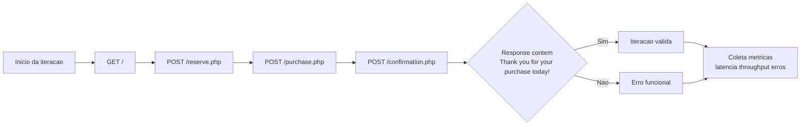
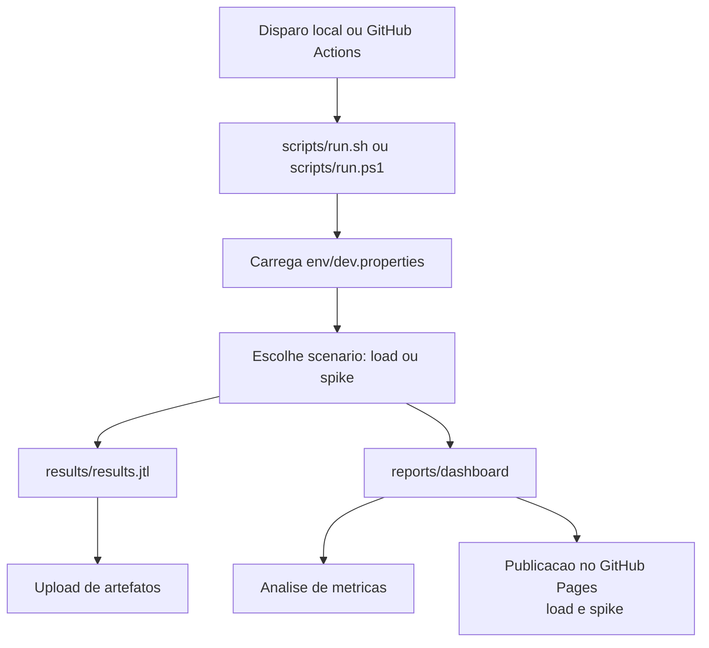

# Fluxo de Teste de Performance

## Objetivo

Validar a jornada de compra no BlazeDemo sob carga controlada em 250 RPS, medindo principalmente throughput e p90.

## Fluxo funcional

1. Home (`GET /`)
2. Busca de voos (`POST /reserve.php`)
3. Escolha do voo (`POST /purchase.php`)
4. Confirmacao da compra (`POST /confirmation.php`)
5. Validacao da mensagem de sucesso

## Diagrama (Mermaid)

## Fluxo de execucao no JMeter

1. `BlazeDemo_Load.jmx`: thread group de carga por 5 minutos com 250 RPS.
2. `BlazeDemo_Spike.jmx`: thread group de pico por 5 minutos com 250 RPS e maior concorrencia.
3. Resultado consolidado em `results/results.jtl`.
4. Relatorio HTML consolidado em `reports/dashboard/`.
5. CI publica artefatos, quadro comparativo no summary e dashboards no GitHub Pages (`/load` e `/spike`).

## Diagrama de execucao (local e CI)

